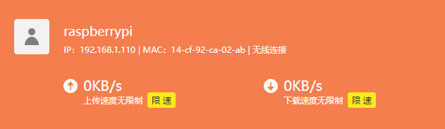
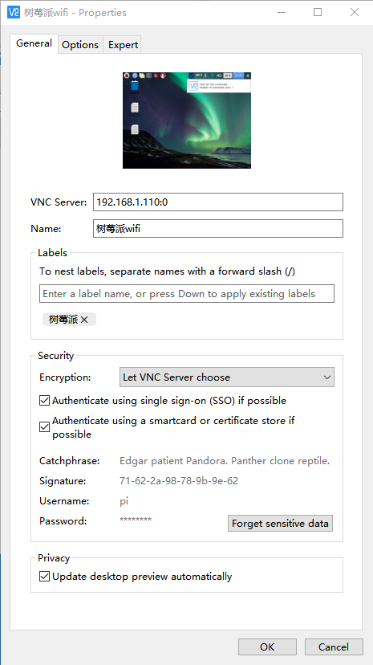
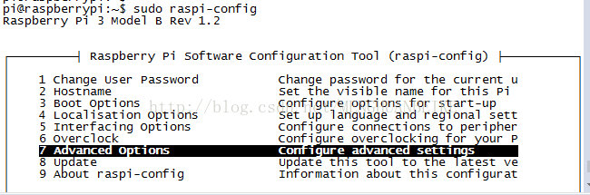
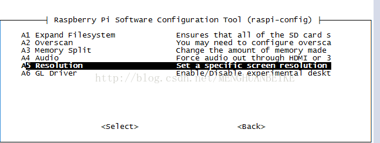
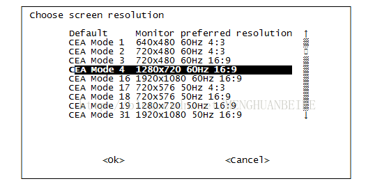

# 树莓派 远程VNC的设置（包括开机启动）

现在  最新版的官方系统已经自带VNCserver 只需要在设置里启用一下，然后设置就可以用啦。

1. 在控制台 root 用户下

   ```shell
   sudo raspi-config
   ```

   选择5.Interfacing Options

   找到VNC（远程桌面）  选择 Yes（是）enable

   然后重启

   ```shell
   sudo reboot
   ```

2. 开始正式配置VNC

   ```shell
   sudo nano /etc/init.d/vncserver
   ```
   或者

   ```shell
   sudo vim /etc/init.d/vncserver
   ```
     ```shell
   sudo mv vncsever /etc/init.d/
   ```
   文件内容：
   ```shell
      #!/bin/sh
   ### BEGIN INIT INFO
   # Provides:          vncserver
   # Required-Start:    $local_fs
   # Required-Stop:     $local_fs
   # Default-Start:     2 3 4 5
   # Default-Stop:      0 1 6
   # Short-Description: Start/stop vncserver
   ### END INIT INFO
    
   # More details see:
   # http://www.penguintutor.com/linux/vnc
    
   ### Customize this entry
   # Set the USER variable to the name of the user to start vncserver under
   export USER='pi'
   ### End customization required
    
   eval cd ~$USER
    
   case "$1" in
     start)
       # 启动命令行。此处自定义分辨率、控制台号码或其它参数。
       su $USER -c '/usr/bin/vncserver -depth 16 -geometry 1680x1050 :1'
       echo "Starting VNC server for $USER "
       ;;
     stop)
       # 终止命令行。此处控制台号码与启动一致。
       su $USER -c '/usr/bin/vncserver -kill :1'
       echo "vncserver stopped"
       ;;
     *)
       echo "Usage: /etc/init.d/vncserver {start|stop}"
       exit 1
       ;;
   esac
   exit 0
   ```
   01： ESC  ：wq  保存退出
   02： 修改权限
   ```shell
   sudo chmod 755 /etc/init.d/vncserver
   ```
   03: 添加开机启动项
   ```shell
   sudo update-rc.d vncserver defaults
   ```
   04: 重启树莓派
   ```shell
   sudo reboot
   ```

   3.  树莓派开机后 就可以连接VNC
     01：在路由器里找树莓派的ip地址 
     
     02：在vnc viewer里设置 

     ip地址： 192.168.1.111:0  
     关于0端口，vnc的端口是在5900的基础上加的
     就是1端口就是5901  2端口就是5902了
     0端口是和HDMI输出是一样的，意思就是，当你连上大屏幕 ，
     再连接0端口 看到的内容是一样的
     0端口和1端口是两个不同的屏幕，相互不影响，相同端口看到的内容是一样的

     默认树莓派的用户名：pi  密码：zxszxs
     

##分辨率问题
树莓派在使用vnc的时候分辨率特别低，甚至无法显示整个桌面，所以需要对vnc登录的分辨率进行设置。其实在树莓派上设置vnc的分辨率很简单，只需要用raspi-config命令就能设置。

       设置方法是在终端输入：sudo raspi-config 命令，然后按下面的顺序选择分辨率设置 Advanced Options > Resolution。



最后重启树莓派就行了。