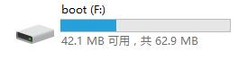
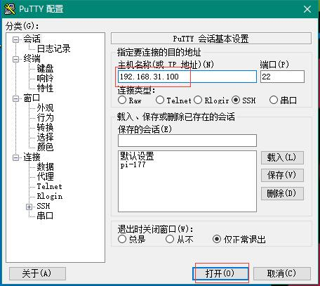

#树莓派初始化设置
##安装操作系统
安装方式1.下载NOOBS 解压到SD（格式化用SD Formatter ）
  树莓派开机就可以选择要安装的操作系统
安装方式2.下载系统  最新的 2017-11-16-rpd-x86-stretch.iso 
  用win32DiskImager 选择镜像，选择盘符，点Write 等待提示成功就好了。
## SSH设置
1. sd卡插入电脑

 
 找到boot  新建一个叫ssh的空文件（没有后缀的）把内存卡插入树莓派，把树莓派通过网线连接 到             路由器上，连接电源，开机如果红灯常亮，绿灯不常亮，基本就正常了（绿灯应该不规则闪烁或熄灭）

2. 找到树莓派的IP地址

   这有多种方法，比如：端口扫描；查看arp（在命令提示符里arp-a）；或者在路由器里的客户端列表寻找。

3. ssh 连接

   远程连接使用putty.exe这个软件
   

   连接上后，会提示需要输入账号和密码，树莓派的默认账号是pi,默认密码是raspberry,注意密码输入的时候是没有*号来告诉你输了几位的。

   登录成功后 会提示：

   pi@raspberrypi ~ $

   这时就登录成功了。

